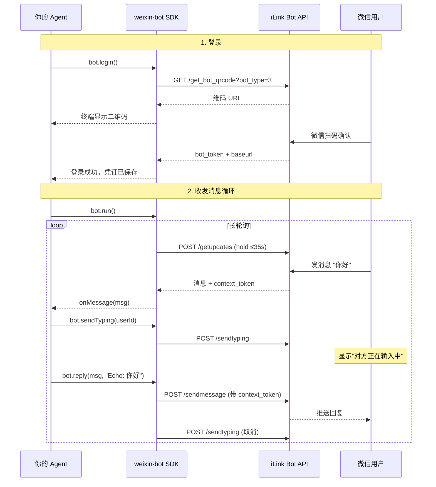

# weixin-bot

微信 iLink Bot SDK — 让任何 Agent 5 分钟接入微信消息。

## 特性

- 扫码登录，凭证自动保存
- 长轮询收消息，HTTP 发消息
- context_token 自动管理，开发者无需关心
- Typing 状态（"对方正在输入中"）
- Session 过期自动重登录
- 零配置，零 Webhook，纯本地运行

## 快速开始

### Node.js

```bash
npm install @pinixai/weixin-bot
```

```typescript
import { WeixinBot } from '@pinixai/weixin-bot'

const bot = new WeixinBot()
await bot.login()

bot.onMessage(async (msg) => {
  await bot.sendTyping(msg.userId)
  await bot.reply(msg, `Echo: ${msg.text}`)
})

await bot.run()
```

### Python

```bash
pip install weixin-bot-sdk
```

```python
from weixin_bot import WeixinBot

bot = WeixinBot()
bot.login()

@bot.on_message
async def handle(msg):
    await bot.send_typing(msg.user_id)
    await bot.reply(msg, f"Echo: {msg.text}")

bot.run()
```

### .NET 9

```bash
cd dotnet/examples/EchoBot
dotnet run
```

```csharp
using Pinix.WeixinBot;

var bot = new WeixinBot();
await bot.LoginAsync();

bot.OnMessage(async message =>
{
    await bot.SendTypingAsync(message.UserId);
    await bot.ReplyAsync(message, $"Echo: {message.Text}");
});

await bot.RunAsync();
```

## 工作原理



## API

| 方法 | 说明 |
|---|---|
| `login(force?)` | 扫码登录，已有凭证则自动跳过 |
| `onMessage(handler)` | 注册消息处理回调 |
| `reply(msg, text)` | 回复消息（自动取消 typing） |
| `send(userId, text)` | 主动发消息（需已有 context_token） |
| `sendTyping(userId)` | 显示"对方正在输入中" |
| `stopTyping(userId)` | 取消输入状态 |
| `run()` | 启动长轮询循环 |
| `stop()` | 停止 |

## 协议文档

完整的微信 iLink Bot API 协议分析见 [docs/protocol-spec.md](docs/protocol-spec.md)（1200+ 行，含 curl 示例和 mermaid 时序图）。

## 关键协议发现

| 发现 | 结论 |
|---|---|
| `context_token` | 回复时必须原样传回，否则消息无法投递。SDK 内部自动管理 |
| `message_state: GENERATING` | API 层面可用，但微信客户端不渲染气泡更新。不建议使用 |
| `sendtyping` | 唯一能触发"对方正在输入中"的方式 |
| Session 过期 (`errcode: -14`) | 需要重新扫码登录。SDK 自动处理 |

## 示例

- [Node.js Echo Bot](examples/nodejs/echo-bot.ts) — 完整示例，含日志和 typing
- [Node.js 流式测试](examples/nodejs/stream-test.ts) — GENERATING vs FINISH 测试
- [Node.js Typing 测试](examples/nodejs/generating-test.ts) — sendtyping vs GENERATING 对比
- [.NET Echo Bot](dotnet/examples/EchoBot/Program.cs) — .NET 9 最小可运行示例

## 包

| 包 | 安装 | 状态 |
|---|---|---|
| [@pinixai/weixin-bot](nodejs/) | `npm install @pinixai/weixin-bot` | [](https://www.npmjs.com/package/@pinixai/weixin-bot) |
| [weixin-bot-sdk](python/) | `pip install weixin-bot-sdk` | [](https://pypi.org/project/weixin-bot-sdk/) |
| [Pinix.WeixinBot](dotnet/) | `dotnet add reference ./dotnet/src/Pinix.WeixinBot/Pinix.WeixinBot.csproj` | 本地 SDK / `net9.0` |

## License

MIT
